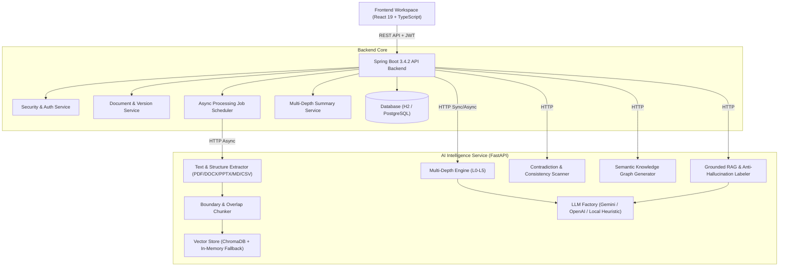

# System Architecture: ANTI-SUMMARY

## High-Level Architecture Overview

## The Anti-Gravity Principle: Graceful Degradation Strategy

| Failure Scenario | Fallback Mechanism | User Experience Impact |
|---|---|---|
| **External LLM Outage** | Switches dynamically to `Local Heuristic Engine` | Summaries generated instantaneously using linguistic pattern extractors. No 500 error. |
| **Vector DB Unavailable** | Switches dynamically to `In-Memory Cosine Store` | Similarity search executed in memory via dot-product normalization. |
| **Scanned / Image PDF** | Scanned page detector with OCR advisory | System informs user and provides failure-first diagnostic guidance. |
| **High Traffic Spike** | Non-blocking async `ProcessingJob` architecture | User receives instant Job ID and can monitor stage-by-stage progress (0-100%). |
| **Network Disconnect** | Standard RFC 7807 problem details with user remedy | Clear remediation instructions returned instead of generic error codes. |
